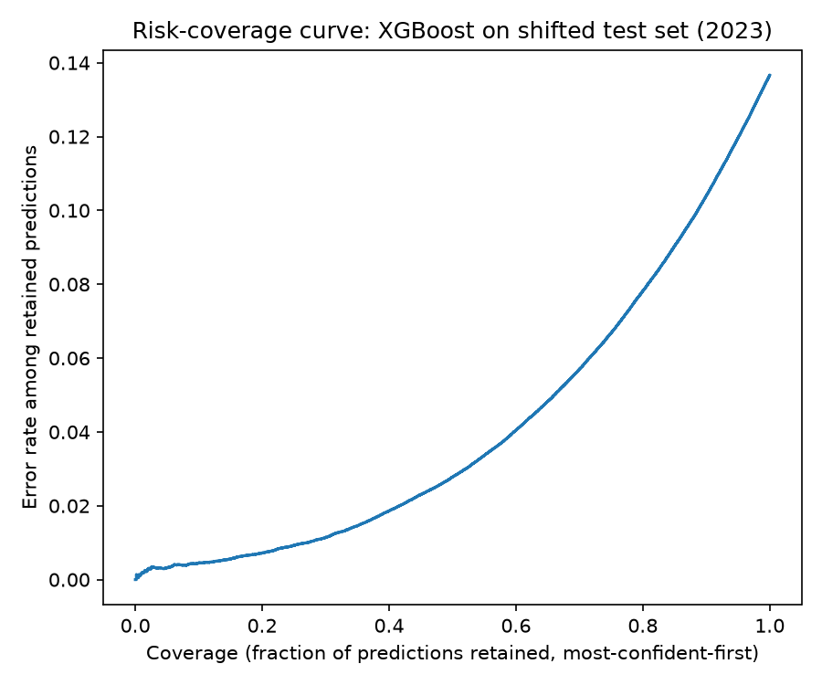

# Reliable ML Under Distribution Shift
### Uncertainty-Aware Health Risk Prediction


**Does a model know when it might be wrong?**

Machine-learning models can look excellent in development and still fail quietly
in deployment — not by crashing, but by staying confidently wrong once the data
they see no longer looks like the data they were trained on. In healthcare,
that gap is dangerous: patient populations, practices, and data collection
drift across time, geography, and demographics, and a model that can't tell
you it's out of its depth is a model you can't trust.

This project trains diabetes-risk classifiers on the CDC's [Behavioral Risk
Factor Surveillance System](https://www.cdc.gov/brfss/) (BRFSS), evaluates them
under **real temporal distribution shift** (train on earlier survey years,
test on later ones — not synthetic noise), and asks a sharper question than
standard evaluation does: when the model's confidence is high, is it actually
*earned*? Calibrated probabilities and conformal prediction are tested as the
mechanism for flagging unreliable predictions, and lightweight recalibration
is tested as the fix once shift is detected.

📄 Full proposal: [`docs/PROPOSAL.md`](docs/PROPOSAL.md) (readable on GitHub) · [`docs/proposal.docx`](docs/proposal.docx) (formatted download)

---

## Research question

> When a health-risk prediction model encounters distribution shift, can
> uncertainty estimation reliably identify predictions that are likely to be
> incorrect — and can adaptation methods restore reliable performance?

## Related work

This isn't the first study of ML reliability under shift — it targets a
specific, underexplored corner of it: naturally occurring temporal shift in
tabular healthcare survey data, rather than synthetic corruption on image/text
benchmarks. Grounded in:

- Ovadia et al. (2019), Lakshminarayanan et al. (2017), Gal & Ghahramani (2016) — uncertainty estimates (including deep ensembles and MC-dropout, both implemented here) degrade under dataset shift
- Guo et al. (2017); Niculescu-Mizil & Caruana (2005) — post-hoc calibration is effective in-distribution, less studied under shift
- Vovk, Gammerman & Shafer (2005); Tibshirani et al. (2019) — conformal prediction's coverage guarantees break under covariate shift
- Koh et al. (2021) — WILDS, the standard shift benchmark, is mostly image/text
- Malinin et al. (2021) — uncertainty specifically for gradient-boosted trees, this project's primary model family
- Guo et al. (2022, 2023) — the closest prior design: MIMIC-IV split into year groups to study temporal shift directly, though on hospital EHR data and centered on adaptation rather than uncertainty-as-failure-detector

All 11 references verified against primary sources (not from memory) — full
list with arXiv/DOI links in
[`docs/PROPOSAL.md`](docs/PROPOSAL.md#1-background-and-related-work).

## Status

The lab gave full latitude on target variable, years, and timeline, so those
decisions are made and documented rather than left as open questions:

- **Target:** BRFSS diabetes indicator (`DIABETE3`/`DIABETE4` — renamed
  partway through the study window, confirmed to share identical coding)
- **Years:** 2017 (train) → 2019 (validation) → 2021 (adaptation sample) →
  2023 (final test). Restricted to odd years only — 2018/2022 were checked
  against the real files and completely lack the blood-pressure/cholesterol
  survey module that year, which would have confounded "distribution shift"
  with "missing feature." Full rationale in `src/data/brfss_schema.py`.
- **Compute:** classical baselines ran on local CPU (no GPU needed). Exea
  Labs is providing AMD Instinct MI300X access for the deep-learning
  uncertainty extension below, which does need it.
- **Timeline:** open-ended — no fixed deadline from the lab.
- **Deliverable:** a full paper, not just an internal report (Section 3 of
  the proposal originally scoped this as a stretch goal; it's now the
  confirmed target).

## Acknowledgments

This research is conducted with mentorship from **Avneh Singh Bhatia**
(Exea Labs). GPU experiments (see below) run on **AMD Instinct MI300X**
accelerators provided by AMD via Exea Labs. Full attribution will appear in
the paper once those experiments are in — see `reports/report.md`'s
Acknowledgments section, added at that point rather than claimed in advance
of actually running on the hardware.

## Results (Phases 2–5, first pass)

📊 Full write-up with figures: [`reports/report.md`](reports/report.md) · raw numbers: [`reports/phase2-5_results.json`](reports/phase2-5_results.json)

| | val (2019) | test (2023, +6 yrs) |
|---|---|---|
| XGBoost AUROC (best of 3 models tried) | 0.836 | 0.828 |
| XGBoost ECE (raw) | 0.003 | 0.005 |
| Conformal coverage (target 90%) | 90.0% | 89.7% |
| Failure-detection AUROC | — | **0.815** |



Headline finding: **the shift is real but mild on average**, and the
model's uncertainty is genuinely informative regardless — restricting to its
most-confident 20% of 2023 predictions yields under 1% error (full curve
above). Recalibrating on a small 2021 sample tightens calibration further
(ECE 0.005 → 0.001) at no cost to discrimination.

**But "mild" is an average that hides a real subgroup gap:** AUROC on the
2023 test set falls from 0.836 (age 18–44) to 0.811 (45–64) to **0.750**
(65+) — an equalized-odds difference 27x larger than the (negligible) gap by
sex.

**And geography, isolated from time, is a genuinely larger shift than 6
years was:** training on Northeast respondents (2023) and evaluating on the
South, conformal coverage drops 90.0% → **87.3%** — roughly 9x the drop seen
under the full 6-year temporal shift — and calibration error is nearly 18x
worse, consistent with the South's well-documented higher diabetes
prevalence. **Weighted conformal prediction (Tibshirani et al., 2019)
recovers about half of that lost coverage** (South: 87.3% → 88.7%) at the
cost of modestly larger prediction sets — the theoretically-prescribed fix
works, partially, exactly as expected. See
[`reports/report.md`](reports/report.md) for the complete discussion, all
eight figures, and limitations.

## Roadmap

| Phase | Focus | Entry point |
|---|---|---|
| 0 | Literature review | `docs/` |
| 1 | Data acquisition & preprocessing | `scripts/download_brfss.py`, `scripts/build_dataset.py` |
| 2–5 | Baselines, shift eval, calibration/conformal, adaptation | `scripts/run_pipeline.py` |
| ext. | Subgroup fairness, geographic shift, weighted conformal | `scripts/run_subgroup_analysis.py`, `scripts/run_geographic_shift.py`, `scripts/run_weighted_conformal.py` |
| 6 | Write-up | `reports/` |

## Quickstart

```bash
python scripts/download_brfss.py    # ~450 MB, four BRFSS years, public CDC data
python scripts/build_dataset.py     # extract + clean -> data/processed/brfss_clean.parquet
python scripts/run_pipeline.py      # baselines, shift eval, calibration, conformal, adaptation
python scripts/run_subgroup_analysis.py   # extension: fairness by sex/age
python scripts/run_geographic_shift.py    # extension: shift by US Census region
python scripts/run_weighted_conformal.py  # extension: does reweighting recover the lost coverage?
```

## Setup

Requires Python 3.10+ (type hints use the `X | Y` syntax).

```bash
python -m venv .venv
.venv\Scripts\activate       # Windows
pip install -r requirements.txt
```

## Development & tests

All model-agnostic modules (metrics, calibration, conformal prediction,
baseline training, adaptation, temporal splitting) are covered by a passing
test suite — CI runs it on every push.

```bash
pip install -r requirements-dev.txt
ruff check .
pytest -v
```

## Repo layout

```
configs/          run configuration (target variable, years, seeds)
scripts/          runnable entry points: download data, build dataset, run the full pipeline
src/data/         acquisition + cleaning + temporal split
src/models/       baseline training (Logistic Regression, XGBoost)
src/uncertainty/  calibration, split conformal prediction, failure-detection metrics
src/adaptation/   recalibration on a held-out target-period sample
src/evaluation/   performance/calibration metrics, shift-degradation comparison
tests/            pytest suite for every model-agnostic module
data/raw/         downloaded BRFSS files (gitignored)
data/processed/   cleaned/split datasets (gitignored)
reports/          final write-up and figures
docs/             full proposal + literature review notes
```

## Contributors

| | |
|---|---|
| **Edmund Eric Gah** | Researcher & maintainer — [gahedmund146@gmail.com](mailto:gahedmund146@gmail.com) |

Contributions and mentor guidance welcome once the project is underway — open
an issue or reach out directly.

## License

Released under the [MIT License](LICENSE). See [`CITATION.cff`](CITATION.cff) for citation.
