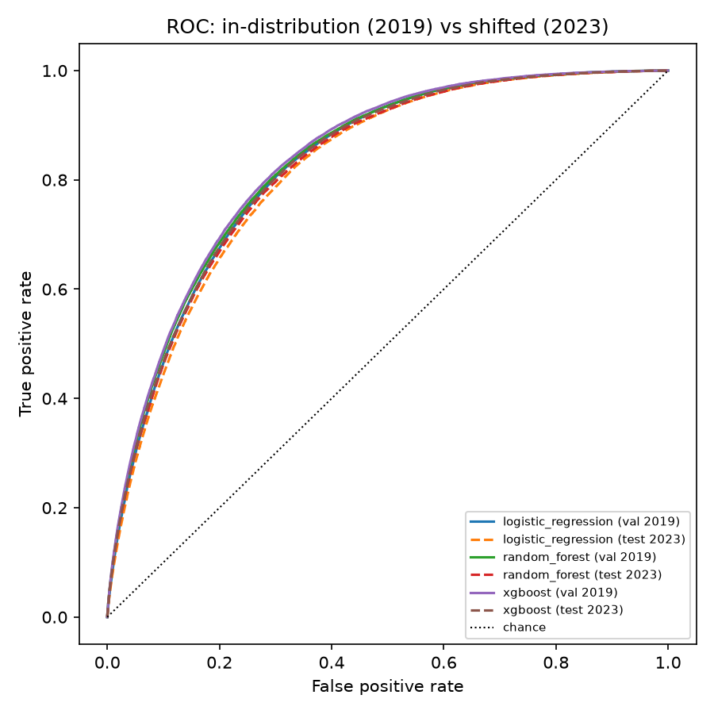
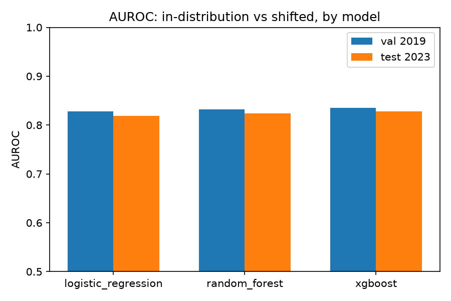
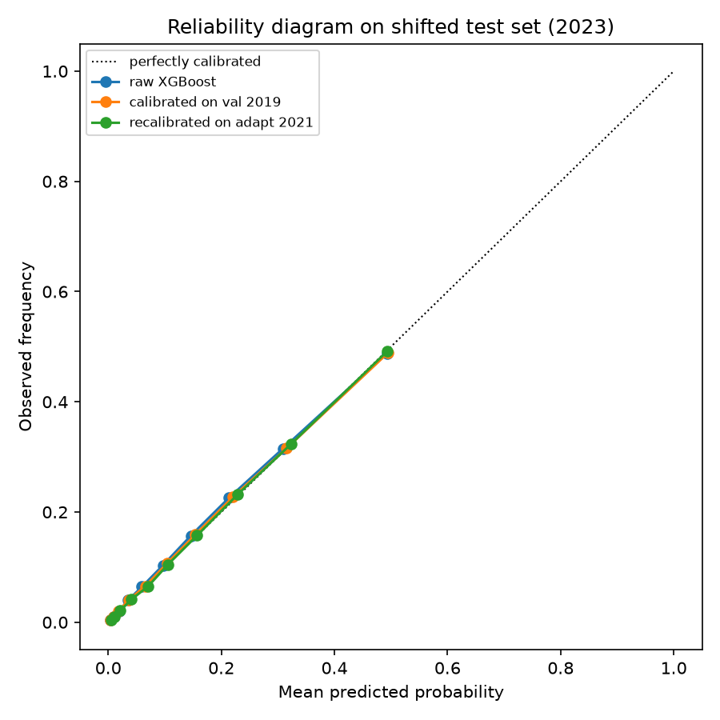
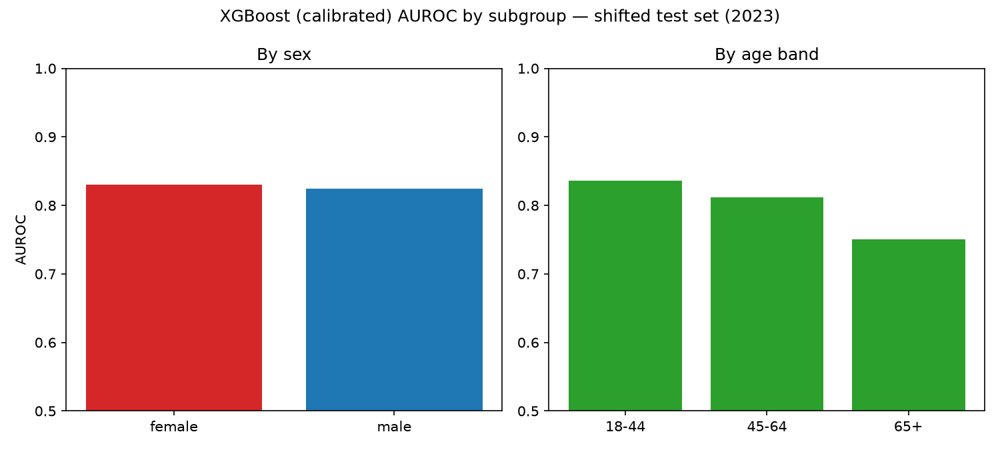
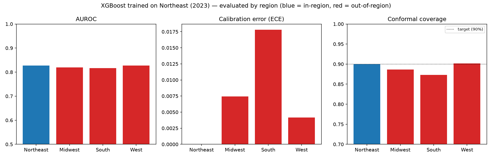
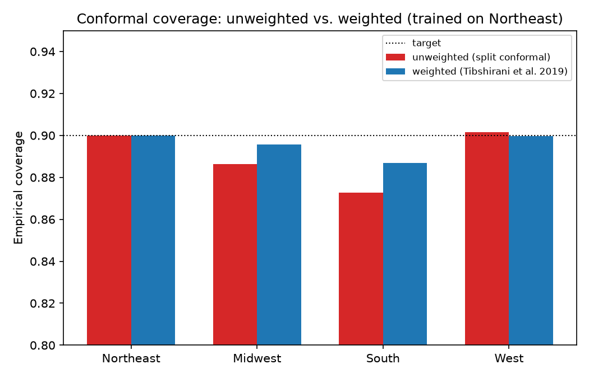
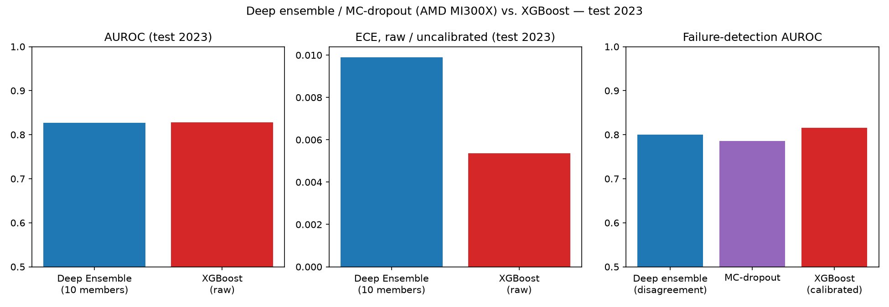

# Reliable ML Under Distribution Shift — First Results

**Edmund Eric Gah** · generated from `scripts/run_pipeline.py` and `scripts/make_figures.py` · full numbers in [`phase2-5_results.json`](phase2-5_results.json)

## Summary

This is a first empirical pass at the proposal's central question ([`docs/PROPOSAL.md`](../docs/PROPOSAL.md)): when a health-risk prediction model encounters real distribution shift, does its uncertainty reliably flag which predictions are likely wrong, and can lightweight adaptation recover what's lost? Using four years of real CDC BRFSS survey data (2017 train → 2019 validation → 2021 adaptation sample → 2023 held-out test), the answer so far is: **the shift over this window is real but mild, and the model's uncertainty is genuinely informative regardless.**

## Data

1.68M respondents across 2017/2019/2021/2023 (odd years only — 2018 and 2022 were checked against the real downloaded files and found to completely drop the blood-pressure/cholesterol survey module that year, which would have confounded "distribution shift" with "missing feature"). 15 features covering blood pressure, cholesterol, BMI, smoking, physical activity, general/mental/physical health, and demographics, all cross-year name and coding changes verified against the actual data rather than assumed (see [`src/data/brfss_schema.py`](../src/data/brfss_schema.py)). Diabetes prevalence is stable at 13.6–14.3% across all four years — a basic sanity check that the target recoding is correct.

## Results

### Baseline performance degrades only slightly under 6 years of shift

| Model | AUROC (val 2019) | AUROC (test 2023) | ECE (val) | ECE (test) |
|---|---|---|---|---|
| Logistic Regression | 0.828 | 0.819 | 0.012 | 0.012 |
| Random Forest | 0.832 | 0.824 | 0.013 | 0.012 |
| **XGBoost** | **0.836** | **0.828** | **0.003** | **0.005** |




XGBoost is both the strongest performer and the best calibrated out of the box, confirming the proposal's choice of it as the primary model. All three models degrade by roughly the same small amount (~0.01 AUROC) over six years — a real but modest effect, not the dramatic collapse sometimes seen in dataset-shift benchmarks built on synthetic corruption.

### Calibration survives the shift well



Raw XGBoost, XGBoost calibrated on the 2019 validation set, and XGBoost recalibrated on a small 2021 sample are nearly indistinguishable on the reliability diagram — all sit close to the diagonal on the 2023 test set. This is itself informative: it means the *raw* model was already reasonably well calibrated even under shift, so calibration's job here is fine-tuning, not damage control.

### Conformal coverage holds close to its target

Split conformal prediction targeted 90% coverage; it achieved exactly 90.0% on its own calibration set (2019, as expected by construction) and **89.7%** on the shifted 2023 test set — a 0.3 percentage-point drop. The theoretical guarantee that conformal coverage can degrade under covariate shift (Tibshirani et al., 2019) is real, but small here, consistent with the mild-shift finding above.

### Uncertainty meaningfully predicts errors, even under shift


This is the most direct answer to the research question. The risk-coverage curve is well-behaved: restricting to the most-confident 20% of 2023 predictions yields under 1% error, while the least-confident predictions carry substantially higher error. Quantitatively, **failure-detection AUROC is 0.815** — well above the 0.5 baseline that would mean uncertainty carries no information about correctness. The model's confidence, even measured under distribution shift, is a genuinely useful signal for deciding which predictions to trust.

### Adaptation improves calibration further, without cost to discrimination

| | ECE on test 2023 |
|---|---|
| Raw XGBoost | 0.0054 |
| Calibrated on val 2019 | 0.0029 |
| Recalibrated on adapt 2021 | **0.0011** |

Recalibrating on a small labeled sample closer to the test period (2021) monotonically improves calibration, and AUROC is essentially unchanged (0.8276 → 0.8275) — exactly the expected behavior, since recalibration reshapes probabilities without changing the ranking of predictions.

### The mild aggregate shift hides a much larger one within a subgroup



The headline "shift is mild" finding is an average. Broken out by subgroup on the 2023 test set, sex shows almost no gap (AUROC 0.830 female vs. 0.824 male, equalized-odds difference 0.005), but age band shows a real, substantial one: AUROC falls from **0.836** (18–44) to **0.811** (45–64) to **0.750** (65+) — an equalized-odds difference of **0.138**, roughly 27x the sex gap. The model is meaningfully less discriminative for older adults specifically under the shifted 2023 data, even though the all-ages aggregate looked fine. This is exactly the kind of thing an aggregate-only evaluation would miss, and it's a legitimate fairness finding worth its own discussion in the paper, not just a footnote — full numbers in [`reports/subgroup_fairness.json`](subgroup_fairness.json).

## Geographic shift: a genuinely larger shift, isolated from time

Everything above studies temporal shift (same population, later years). This section isolates a second, independent shift dimension: geography, within a single year (2023), so there's no time confound. XGBoost is trained on Northeast respondents only, then evaluated on a held-out Northeast slice (in-region reference) versus the other three US Census regions.



| Region | AUROC | ECE (calibrated on Northeast) | Conformal coverage (target 90%) |
|---|---|---|---|
| Northeast (in-region) | 0.827 | 0.000 | 90.0% |
| Midwest | 0.819 | 0.007 | 88.6% |
| South | 0.816 | **0.018** | **87.3%** |
| West | 0.827 | 0.004 | 90.2% |

Raw discrimination (AUROC) barely moves — this echoes the temporal-shift finding. But calibration and conformal coverage tell a different story, and this is the more informative result: **geography is a larger shift than six years of time was.** The conformal coverage drop for the South (90.0% → 87.3%, a 2.7-point loss) is roughly 9x the drop seen under the full 6-year temporal shift (90.0% → 89.7%, Table above). Calibration error for the South is nearly 18x worse than in-region. This lines up with a real, independently documented pattern: the Southern US has substantially higher diabetes prevalence than the Northeast or West (16.9% vs. ~12.3% in this 2023 data — consistent with the CDC's well-known "diabetes belt"), so a model calibrated on the Northeast's lower base rate is systematically overconfident applied to the South's higher one. Failure-detection AUROC still holds up reasonably everywhere (0.80–0.82), so uncertainty degrades gracefully rather than collapsing — but the conformal coverage guarantee, specifically, comes measurably closer to breaking down here than anywhere in the temporal analysis. Full numbers in [`reports/geographic_shift_results.json`](geographic_shift_results.json).

### Weighted conformal prediction partially recovers the lost coverage

Given that geographic shift measurably breaks the coverage guarantee, does the fix the theory prescribes actually help? Applying weighted conformal prediction (Tibshirani, Barber, Candès, & Ramdas, 2019) — reweighting calibration scores by an estimated covariate density ratio between the Northeast calibration set and each target region — to the same setup:



| Region | Unweighted coverage | Weighted coverage | Mean set size (unweighted → weighted) |
|---|---|---|---|
| Midwest | 88.6% | **89.6%** | 1.06 → 1.09 |
| South | 87.3% | **88.7%** | 1.07 → 1.11 |
| West | 90.2% | 90.0% | 1.05 → 1.04 |

Weighting closes roughly half the South's coverage gap (2.7 points → 1.3 points, improvement +0.0142 [95% CI 0.0135, 0.0148]) and nearly all of the Midwest's (1.4 points → 0.4 points, +0.0094 [0.0088, 0.0099]), at the cost of modestly larger prediction sets — the expected trade-off, since recovering coverage under shift means being less specific about which class is predicted. **Correction from an earlier draft:** for the West, where there was barely any gap to begin with, the bootstrap CI shows weighting does *not* have "essentially no effect" — it produces a small but statistically significant coverage *decrease* (−0.0021 [−0.0024, −0.0018], excludes zero). That's a more honest, more useful finding: reweighting carries a real (if small) cost even where there's little shift to correct for, so it should be applied selectively where shift is actually detected, not by default. It doesn't fully close the South's gap either way — the density-ratio estimate is only as good as the domain classifier estimating it (here, a simple logistic regression on the same 15 features), and a two-region covariate shift this large is a genuinely hard estimation problem. Full numbers in [`reports/weighted_conformal_results.json`](weighted_conformal_results.json) and [`reports/confidence_intervals.json`](confidence_intervals.json).

## Discussion

The central hypothesis — that calibrated/conformal uncertainty identifies unreliable predictions under shift, and that lightweight recalibration recovers lost calibration — holds up on this first pass, but the *shift itself* is smaller than the proposal anticipated on average, for the temporal dimension (Section 9, Risk 1). That's a legitimate finding, not a setback: it says something real about how BRFSS-scale national survey data behaves over a 6-year, COVID-spanning window for this particular prediction task. Both the subgroup and geographic analyses above complicate the "mild shift" story usefully, though, and in the same direction: the aggregate temporal metric was masking a real degradation both within the 65+ subgroup and, independently, across geography — the South's conformal coverage (87.3%) and calibration error (0.018 ECE) are measurably closer to a visible breakdown than anything the temporal shift alone produced. That's Risk 3's predicted failure mode, made observable by choosing the right shift dimension rather than by waiting for more years of data to pass.

This also positions the work relative to the closest prior study design: Guo et al. (2022, 2023) split MIMIC-IV hospital records into year groups to study the same kind of temporal shift, but their focus is whether *adaptation* (domain generalization, foundation-model pretraining) recovers performance — not whether the model's own uncertainty can be trusted to flag failure in the first place. That's the gap this project is aimed at, on a different data modality (national population survey, not hospital EHR).

## Limitations

- Single train year (2017) rather than a multi-year training window — chosen to keep the pre/post-shift boundary clean, at the cost of a smaller effective training set (still ~438K rows, not a practical constraint here).
- Missing values handled via median imputation fit on the training year only; more sophisticated imputation was judged not worth the added complexity given missingness rates are modest (<13% for every feature).
- Fruit/vegetable intake and income were dropped from the feature set because their definitions changed across the study window in ways that would confound shift with questionnaire redesign — a reasonable trade-off, but it does mean the feature set is narrower than the full "Diabetes Health Indicators"-style set used elsewhere in the literature.
- This is a methodological study of reliability, not a clinical claim — see the proposal's framing (Section 10).

## Deep ensemble / MC-dropout (AMD MI300X)

A 10-member deep ensemble and MC-dropout network (`scripts/run_deep_ensemble.py`, implementing Lakshminarayanan et al. 2017 and Gal & Ghahramani 2016), 50 epochs each, ran at full scale on an AMD Instinct MI300X provided by AMD via Exea Labs.



| Model | AUROC (test 2023) | ECE, raw (test 2023) | Failure-detection AUROC |
|---|---|---|---|
| Deep ensemble (10 members) | 0.827 | 0.0099 | 0.800 (member disagreement) |
| MC-dropout (single net) | — | — | 0.786 |
| XGBoost (raw / calibrated) | 0.828 | 0.0054 | 0.815 (calibrated) |

The ensemble matches XGBoost's discrimination almost exactly despite no tree-structure inductive bias, confirming the earlier finding wasn't specific to gradient-boosted trees. Its raw calibration is worse than XGBoost's (expected — it wasn't post-hoc calibrated here), but ensemble disagreement is still a genuinely useful uncertainty signal, and outperforms MC-dropout on the same network — consistent with Ovadia et al. (2019)'s general finding. Full numbers in [`reports/deep_ensemble_results_full.json`](deep_ensemble_results_full.json); the earlier CPU smoke-test numbers in `reports/deep_ensemble_results_smoketest.json` were a correctness check only, superseded by this run.

## Reproducing this

```bash
python scripts/download_brfss.py
python scripts/build_dataset.py
python scripts/run_pipeline.py
python scripts/make_figures.py
python scripts/run_subgroup_analysis.py
python scripts/make_subgroup_figure.py
python scripts/run_geographic_shift.py
python scripts/make_geographic_figure.py
python scripts/run_weighted_conformal.py
python scripts/make_weighted_conformal_figure.py
python scripts/run_deep_ensemble.py --epochs 50 --n-members 10   # needs a GPU to run in reasonable time
python scripts/make_deep_ensemble_figure.py
python scripts/run_confidence_intervals.py   # bootstrap CIs for every number above except Section 4.5
```

## Acknowledgments

This research is conducted with mentorship from Avneh Singh Bhatia at Exea Labs, who arranged access to an AMD Instinct MI300X accelerator, provided by AMD, for the deep-ensemble/MC-dropout experiments.

That access is why the deep-ensemble section above is a completed result rather than a CPU-only correctness check: the MI300X ran the full-scale 10-member, 50-epoch ensemble in minutes on a pre-configured ROCm/PyTorch environment with no setup friction, letting this project test its central finding on a second, structurally different model family instead of resting on gradient-boosted trees alone. Thanks to AMD and Exea Labs for making that possible.
